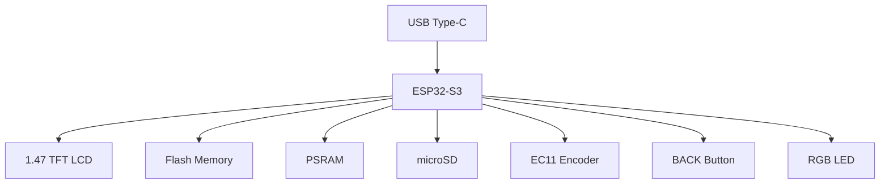

# Hardware Overview

Hardware overview of the **KeyKeeper2** platform based on the **Waveshare ESP32-S3-LCD-1.47B** development board.

---

# Purpose

This document provides a high-level overview of the hardware platform used by the KeyKeeper2 project.

It serves as the starting point for understanding the hardware architecture before diving into individual subsystems described in the remaining documents of the **docs/hardware** directory.

---

# Platform Overview

KeyKeeper2 is a standalone embedded device built around the **ESP32-S3** microcontroller and the **Waveshare ESP32-S3-LCD-1.47B** development board.

The platform combines:

* ESP32-S3 MCU
* 1.47" TFT LCD
* Internal Flash
* PSRAM
* microSD card
* Native USB
* RGB status LED
* External rotary encoder (EC11)
* BACK button

The firmware uses ESP-IDF as the software platform and communicates directly with the board peripherals through the BSP layer.

---

# Hardware Architecture



---

# Main Hardware Components

| Component         | Description                       |
| ----------------- | --------------------------------- |
| MCU               | ESP32-S3 Dual-Core Xtensa LX7     |
| Development Board | Waveshare ESP32-S3-LCD-1.47B      |
| Display           | 1.47" TFT LCD                     |
| Storage           | Internal Flash + PSRAM + microSD  |
| User Input        | EC11 Rotary Encoder + BACK Button |
| USB               | Native USB Type-C                 |
| Status Indicator  | RGB LED                           |

---

# Functional Subsystems

The hardware platform is divided into several independent subsystems.

| Subsystem         | Document           |
| ----------------- | ------------------ |
| Development Board | `01_board.md`      |
| Display           | `02_display.md`    |
| User Input        | `03_input.md`      |
| Power Supply      | `04_power.md`      |
| Storage           | `05_storage.md`    |
| Interfaces        | `06_interfaces.md` |
| Boot Process      | `07_boot.md`       |

Each subsystem has its own dedicated document.

---

# Storage Architecture

The project uses multiple storage devices.

```text
Internal Flash
├── Bootloader
├── Firmware
├── NVS
└── Configuration

microSD
├── database/
├── backup/
├── import/
├── export/
├── certificates/
└── logs/
```

The internal Flash is reserved for firmware and system configuration.

The microSD card is used for user data, backups and file exchange.

---

# User Interface Hardware

Unlike the original Waveshare demonstration projects, KeyKeeper2 does **not** use a touch interface.

User interaction is implemented using:

* EC11 rotary encoder
* Encoder push button (OK)
* Dedicated BACK button

This solution provides reliable operation while simplifying the graphical interface.

---

# Hardware Interfaces

The platform uses the following hardware interfaces.

| Interface | Purpose                       |
| --------- | ----------------------------- |
| SPI       | LCD and microSD               |
| USB       | Programming and communication |
| GPIO      | User input and peripherals    |
| PWM       | LCD backlight                 |
| UART      | Debug console                 |

A complete GPIO allocation is documented in **06_interfaces.md**.

---

# Hardware Documentation

The remaining documents describe each subsystem in detail.

| Document                 | Description              |
| ------------------------ | ------------------------ |
| `01_board.md`            | Board description        |
| `02_display.md`          | LCD subsystem            |
| `03_input.md`            | Encoder and buttons      |
| `04_power.md`            | Power subsystem          |
| `05_storage.md`          | Flash, PSRAM and microSD |
| `06_interfaces.md`       | GPIO and interfaces      |
| `07_boot.md`             | Boot sequence            |
| `08_revision_history.md` | Hardware revisions       |

---

# Summary

KeyKeeper2 is built on a proven ESP32-S3 hardware platform while extending it with a custom user interface based on a rotary encoder and dedicated control buttons.

This document provides a general overview of the hardware architecture and serves as an entry point for the detailed hardware documentation contained in this directory.
