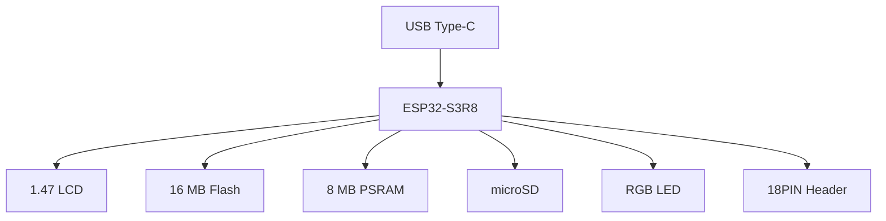

# Board Description

Detailed description of the hardware platform used by the **KeyKeeper2** project.

The project is based on the **Waveshare ESP32-S3-LCD-1.47B** development board.

---

# Purpose

This document describes the physical hardware platform used by KeyKeeper2.

It contains information required for firmware development, including:

* board layout;
* hardware components;
* onboard peripherals;
* available connectors;
* hardware limitations;
* GPIO allocation overview.

Detailed information about individual subsystems is provided in the corresponding documents within this directory.

---

# Board Information

| Parameter         | Value                        |
| ----------------- | ---------------------------- |
| Board             | Waveshare ESP32-S3-LCD-1.47B |
| MCU               | ESP32-S3R8                   |
| CPU               | Dual-Core Xtensa LX7         |
| Maximum Frequency | 240 MHz                      |
| Internal SRAM     | 512 KB                       |
| PSRAM             | 8 MB                         |
| Flash             | 16 MB                        |
| USB               | Native USB Type-C            |
| Wireless          | Wi-Fi 2.4 GHz + Bluetooth LE |
| Display           | 1.47" TFT LCD                |
| LCD Controller    | ST7789                       |
| LCD Resolution    | 172 × 320                    |
| Touch Panel       | No                           |
| Expansion         | 18PIN Header                 |
| RGB LED           | Yes                          |
| microSD Slot      | Yes                          |

---

# Board Overview

The Waveshare ESP32-S3-LCD-1.47B integrates all hardware required by the KeyKeeper2 firmware.

The board includes:

* ESP32-S3 microcontroller;
* TFT LCD display;
* LCD backlight circuit;
* USB Type-C interface;
* RGB status LED;
* microSD card slot;
* onboard Flash;
* onboard PSRAM;
* 18-pin expansion header.

KeyKeeper2 uses the board without any hardware modifications.

---

# KeyKeeper2 Hardware Configuration

Compared to the original Waveshare demonstration firmware, the KeyKeeper2 project uses a different hardware configuration.

| Feature        | Waveshare Demo | KeyKeeper2 |
| -------------- | -------------- | ---------- |
| LCD            | ✔              | ✔          |
| Touch Panel    | ✖              | ✖          |
| USB Device     | ✔              | ✔          |
| microSD        | ✔              | ✔          |
| RGB LED        | ✔              | ✔          |
| Rotary Encoder | ✖              | ✔ External |
| BACK Button    | ✖              | ✔ External |

The user interface is implemented using an external EC11 rotary encoder and a dedicated BACK button connected to the expansion header.

---

# Board Block Diagram



---

# Main Components

| Component        | Description                           |
| ---------------- | ------------------------------------- |
| ESP32-S3R8       | Main MCU                              |
| LCD Module       | Integrated TFT display                |
| Flash Memory     | Firmware storage                      |
| PSRAM            | External RAM for graphics and buffers |
| microSD Slot     | User storage and backups              |
| USB Type-C       | Power, flashing and communication     |
| RGB LED          | Status indication                     |
| Expansion Header | External peripherals                  |

---

# Expansion Header

The board exposes an 18-pin expansion header that allows additional hardware to be connected without modifying the PCB.

KeyKeeper2 uses this connector for:

- rotary encoder;
- encoder push button;
- BACK button;
- future hardware extensions.

Detailed pin allocation is described in **06_interfaces.md**.

---

# Related Documents

| Document           | Description              |
| ------------------ | ------------------------ |
| `02_display.md`    | LCD subsystem            |
| `03_input.md`      | Encoder and buttons      |
| `04_power.md`      | Power subsystem          |
| `05_storage.md`    | Flash, PSRAM and microSD |
| `06_interfaces.md` | GPIO allocation          |

---

# Board Connectors

This section describes all external connectors available on the Waveshare ESP32-S3-LCD-1.47B board and their usage within the KeyKeeper2 project.

------

# USB Type-C

The board is equipped with a native USB Type-C connector connected directly to the ESP32-S3 USB interface.

## Functions

- Firmware download
- USB Serial/JTAG
- USB Device mode
- Board power supply
- Debugging

## Specifications

| Parameter       | Value               |
| --------------- | ------------------- |
| Connector       | USB Type-C          |
| USB Controller  | Native ESP32-S3 USB |
| Supported Modes | USB Device          |
| Power Input     | 5 V                 |

The USB connector is the primary interface for firmware flashing and communication with the host computer.

------

# microSD Card Slot

A microSD card socket is integrated on the development board.

KeyKeeper2 uses the microSD card as the primary storage location for user data.

## Intended Usage

- Password database
- Backup archives
- Import/export files
- Certificates
- Log files

The firmware is designed so that user data is stored on the removable media whenever possible.

The microSD interface uses **4-bit SDMMC**.

## SDMMC Pin Assignment

| SD Signal | ESP32-S3 GPIO | Function      |
| --------- | ------------- | ------------- |
| CLK       | GPIO14        | SDMMC clock   |
| CMD       | GPIO15        | SDMMC command |
| D0        | GPIO16        | SDMMC data 0  |
| D1        | GPIO18        | SDMMC data 1  |
| D2        | GPIO17        | SDMMC data 2  |
| D3        | GPIO21        | SDMMC data 3  |

Detailed storage architecture is described in **05_storage.md**.

---

# Expansion Header

The board exposes an 18-pin expansion header that provides access to unused GPIO pins and power rails.

This connector is the primary expansion interface used by KeyKeeper2.

## Available Signals

The header provides access to:

- 3.3 V power
- Ground
- GPIO
- UART
- Additional expansion signals

The exact GPIO mapping is documented in **06_interfaces.md**.

------

# User Input Connection

KeyKeeper2 uses the expansion header to connect an external rotary encoder and a dedicated BACK button.

## Recommended Wiring

```
ESP32-S3-LCD-1.47B              EC11 Rotary Encoder


3V3   -------------------------> VCC


GND   -------------------------> GND


GPIO4 -------------------------> Phase A (CLK)


GPIO5 -------------------------> Phase B (DT)


GPIO6 -------------------------> Push Button (OK)


GPIO7 -------------------------> BACK Button
```

All buttons are connected between the GPIO pin and GND using the internal pull-up resistors.

------

# GPIO Assignment

| Function       | GPIO  | Configuration   |
| -------------- | ----- | --------------- |
| Encoder A      | GPIO4 | Input + Pull-up |
| Encoder B      | GPIO5 | Input + Pull-up |
| Encoder Button | GPIO6 | Input + Pull-up |
| BACK Button    | GPIO7 | Input + Pull-up |

The firmware treats all buttons as **active-low** inputs.

------

# Reserved GPIO

The following GPIOs are occupied by onboard hardware and must not be reassigned.

| GPIO      | Reserved For     |
| --------- | ---------------- |
| GPIO0     | BOOT button      |
| GPIO1–3   | Strapping pins   |
| GPIO14–18 | microSD          |
| GPIO21    | microSD          |
| GPIO38    | RGB LED          |
| GPIO39–42 | LCD interface    |
| GPIO45    | LCD MOSI         |
| GPIO48    | LCD backlight    |
| GPIO43–44 | UART             |
| GPIO26–37 | PSRAM (internal) |

These pins are reserved by the hardware platform and should not be used for additional peripherals.

### LCD interface

The onboard LCD is connected to the ESP32-S3 as follows:

| LCD Pin | ESP32-S3 GPIO | Function              |
| ------- | ------------- | --------------------- |
| MOSI    | GPIO45        | SPI data              |
| SCLK    | GPIO40        | SPI clock             |
| LCD_CS  | GPIO42        | SPI chip select       |
| LCD_DC  | GPIO41        | Data / command select |
| LCD_RST | GPIO39        | LCD reset             |
| LCD_BL  | GPIO48        | Backlight control     |

These GPIOs are reserved for the onboard LCD and must not be assigned to external peripherals.

**GPIO46 is not used for the LCD backlight.**

The LCD uses **SPI3_HOST**.

The verified display configuration used by KeyKeeper2 is:

| Parameter       | Value     |
| --------------- | --------- |
| Driver          | LovyanGFX |
| Controller      | ST7789    |
| SPI Host        | SPI3_HOST |
| SPI Mode        | 0         |
| SPI Write       | 27 MHz    |
| SPI Read        | 16 MHz    |
| SPI             | 3-wire    |
| DMA             | Enabled   |
| Offset Rotation | 1         |
| Offset X        | 34        |
| Offset Y        | 0         |
| Invert          | true      |
| RGB Order       | false     |

------

# Available GPIO

The following GPIOs remain available for future expansion.

| GPIO   |
| ------ |
| GPIO8  |
| GPIO9  |
| GPIO10 |
| GPIO11 |
| GPIO12 |
| GPIO13 |

GPIO1–GPIO3 are not included because they are strapping pins.

GPIO4–GPIO7 are reserved for the KeyKeeper2 user interface.

GPIO43–GPIO44 are assigned to UART.

These GPIOs are accessible through the expansion header and may be assigned to future hardware modules if required.

------

# Hardware Recommendations

When connecting additional peripherals:

- avoid using GPIO0 during normal operation;
- do not use GPIO1–GPIO3 for user input or peripherals;
- enable internal pull-up resistors for buttons;
- keep encoder signal wires as short as possible;
- avoid sharing LCD SPI pins with external devices;
- do not reassign GPIOs reserved for microSD, LCD, PSRAM or RGB LED.

------

# Related Documents

| Document           | Description                     |
| ------------------ | ------------------------------- |
| `03_input.md`      | User input subsystem            |
| `05_storage.md`    | Storage subsystem               |
| `06_interfaces.md` | Complete GPIO allocation        |
| `07_boot.md`       | Boot process and strapping pins |

------

# Core Hardware Components

This section describes the primary hardware components integrated on the Waveshare ESP32-S3-LCD-1.47B board and explains how they are used by the KeyKeeper2 project.

------

# ESP32-S3 Microcontroller

The KeyKeeper2 firmware runs on the **ESP32-S3R8** microcontroller manufactured by Espressif Systems.

## Specifications

| Parameter         | Value                |
| ----------------- | -------------------- |
| MCU               | ESP32-S3R8           |
| CPU               | Dual-Core Xtensa LX7 |
| Maximum Frequency | 240 MHz              |
| Internal SRAM     | 512 KB               |
| External PSRAM    | 8 MB                 |
| Flash             | 16 MB                |
| Wi-Fi             | IEEE 802.11 b/g/n    |
| Bluetooth         | Bluetooth LE 5.x     |
| USB               | Native USB OTG       |

The ESP32-S3 is responsible for:

- application execution;
- graphical user interface;
- USB communication;
- storage management;
- Wi-Fi communication;
- event processing.

------

# Flash Memory

The board includes onboard SPI Flash memory used for firmware and system storage.

## Specifications

| Parameter | Value                    |
| --------- | ------------------------ |
| Type      | SPI Flash                |
| Capacity  | 16 MB                    |
| Usage     | Firmware and system data |

---

The Flash contains:

```
Bootloader
Partition Table
Application
OTA Images
NVS
Configuration
LittleFS (optional)
```

User databases are **not** stored in internal Flash.

---

# PSRAM

External PSRAM expands the available working memory of the ESP32-S3.

## Specifications

| Parameter | Value          |
| --------- | -------------- |
| Capacity  | 8 MB           |
| Interface | Octal PSRAM    |
| Purpose   | Runtime memory |

PSRAM is primarily used for:

- LVGL frame buffers;
- image decoding;
- temporary buffers;
- large data structures;
- filesystem cache.

Keeping large buffers in PSRAM helps preserve internal SRAM for time-critical tasks.

------

# RGB Status LED

The development board includes a single programmable RGB LED.

## Usage in KeyKeeper2

The LED is reserved for system status indication.

Typical indications include:

| State    | Meaning             |
| -------- | ------------------- |
| Blue     | Boot process        |
| Green    | Normal operation    |
| Yellow   | Warning             |
| Red      | Error               |
| Flashing | Activity indication |

The LED is controlled exclusively through the system status service.

Applications should never access the LED directly.

------

# LCD Backlight

The LCD backlight is controlled independently from the display controller.

The backlight is connected to **GPIO48**.

The firmware supports:

- backlight enable;
- brightness control;
- automatic dimming;
- display sleep.

Backlight management is implemented by the display subsystem.

------

# Hardware Resources Reserved by the Board

Several hardware resources are permanently assigned to onboard peripherals.

These resources are unavailable for application-specific peripherals.

| Resource  | Used By              |
| --------- | -------------------- |
| LCD SPI   | TFT Display          |
| LCD GPIO  | Display Controller   |
| PSRAM Bus | External RAM         |
| Flash Bus | Firmware Storage     |
| SDMMC     | microSD              |
| USB       | Native USB Interface |
| RGB LED   | System Status        |

The BSP abstracts these resources from the application layer.

------

# Hardware Limitations

The following limitations should be considered during firmware development.

- GPIO used by onboard peripherals cannot be reassigned.
- GPIO1–GPIO3 are strapping pins and should not be used for normal user input.
- GPIO0 is reserved for the BOOT function.
- Flash storage is limited and should not be used for large user databases.
- PSRAM has higher access latency than internal SRAM.
- Display updates consume a significant portion of the available SPI bandwidth.
- The touchscreen is not present on this board.
- The LCD uses SPI3 and its hardware configuration must not be changed by application components.
- microSD uses the dedicated 4-bit SDMMC interface.
- GPIO4–GPIO7 are reserved for the KeyKeeper2 user interface.

These constraints have been taken into account in the KeyKeeper2 architecture.

------

# Related Documents

| Document           | Description                             |
| ------------------ | --------------------------------------- |
| `02_display.md`    | Display subsystem                       |
| `04_power.md`      | Power management                        |
| `05_storage.md`    | Flash, PSRAM and microSD                |
| `06_interfaces.md` | GPIO allocation and hardware interfaces |

------

# Board Design Guidelines

This section describes the hardware design decisions adopted by the KeyKeeper2 project and provides recommendations for future hardware extensions.

------

# Design Philosophy

KeyKeeper2 is designed around the principle of using the standard Waveshare ESP32-S3-LCD-1.47B hardware platform without modifying the original PCB.

All project-specific functionality is implemented through:

- firmware;
- external peripherals connected to the expansion header;
- optional future expansion modules.

This approach simplifies maintenance and allows the firmware to run on any compatible board.

------

# GPIO Allocation Policy

GPIO resources are divided into three categories.

## Reserved GPIO

These GPIOs are permanently assigned to onboard hardware and must never be used by the application.

Examples include:

- LCD interface;
- PSRAM;
- Flash;
- USB;
- RGB LED;
- microSD interface;
- BOOT;
- strapping pins.

------

## Project GPIO

These GPIOs are reserved by the KeyKeeper2 firmware.

| GPIO  | Purpose             |
| ----- | ------------------- |
| GPIO4 | Encoder Phase A     |
| GPIO5 | Encoder Phase B     |
| GPIO6 | Encoder Push Button |
| GPIO7 | BACK Button         |

These assignments are considered part of the hardware specification of the project.

------

## Available GPIO

The following GPIOs remain available for future hardware extensions.

| GPIO   |
| ------ |
| GPIO8  |
| GPIO9  |
| GPIO10 |
| GPIO11 |
| GPIO12 |
| GPIO13 |

Before assigning these pins to new hardware, the GPIO allocation table in **06_interfaces.md** must be updated.

------

# Expansion Policy

Any new peripheral should be connected through the 18-pin expansion header whenever possible.

Preferred expansion devices include:

- additional buttons;
- sensors;
- I²C peripherals;
- SPI peripherals;
- LEDs;
- buzzers.

The original PCB should not require modification for standard project extensions.

------

# User Input Policy

KeyKeeper2 standardizes user interaction through physical controls.

The supported input devices are:

- EC11 rotary encoder;
- encoder push button (OK);
- dedicated BACK button.

Touchscreen input is intentionally not used in this project.

This provides:

- consistent navigation;
- improved reliability;
- simplified firmware;
- better usability with gloves or in industrial environments.

------

# Future Hardware Extensions

The hardware platform has been selected to allow future expansion.

Potential additions include:

- external sensors;
- RTC module;
- NFC reader;
- secure element;
- external storage devices;
- additional communication interfaces.

Whenever possible, new modules should reuse existing buses instead of consuming additional GPIO resources.

------

# Hardware Compatibility

Future revisions of the project should maintain compatibility with the existing hardware platform.

Recommended compatibility rules:

- preserve GPIO assignments;
- avoid changing user input pins;
- maintain storage layout;
- preserve USB functionality;
- preserve LCD and microSD interfaces;
- ensure firmware compatibility across supported board revisions.

------

# Summary

The KeyKeeper2 display subsystem is based on the integrated **1.47" ST7789 TFT LCD** of the **Waveshare ESP32-S3-LCD-1.47B** board.

The definitive display configuration is:

| Parameter | Value |
| --------- | ----- |
| Display | 1.47" TFT LCD |
| Controller | ST7789 |
| Resolution | 172 × 320 |
| Driver | LovyanGFX |
| GUI Framework | LVGL 9 |
| SPI Host | SPI3_HOST |
| SPI Mode | 0 |
| SPI Interface | 3-wire |
| DMA | Enabled |
| Write Frequency | 27 MHz |
| Read Frequency | 16 MHz |
| Offset Rotation | 1 |
| Offset X | 34 |
| Offset Y | 0 |
| Invert | true |
| RGB Order | false |

The LCD GPIO allocation is:

| LCD Function | GPIO |
| ------------ | ---- |
| MOSI | GPIO45 |
| SCLK | GPIO40 |
| LCD_CS | GPIO42 |
| LCD_DC | GPIO41 |
| LCD_RST | GPIO39 |
| LCD_BL | GPIO48 |

The display subsystem owns the complete LCD hardware interface, including:

* ST7789 initialization;
* SPI3 configuration;
* DMA transfers;
* LVGL display integration;
* display flushing;
* display orientation;
* display offsets;
* backlight control;
* display sleep and wake-up.

The GUI layer communicates with the display through **LVGL 9** and must not access the ST7789 controller, LovyanGFX, SPI3 or GPIO48 directly.

The LCD backlight is controlled through **GPIO48**.

**GPIO46 is not used for the LCD backlight.**

The board does not contain a touchscreen. KeyKeeper2 therefore uses the external EC11 rotary encoder and physical buttons for user interaction.

The verified Waveshare LCD configuration described in this document is the hardware baseline for `components/display/` and must not be replaced by generic ST7789 settings.

Any change to the LCD controller, GPIO assignment, SPI host, display geometry or driver configuration must be reflected in:

* `01_board.md`;
* `02_display.md`;
* `06_interfaces.md`;
* the corresponding BSP and display component configuration.