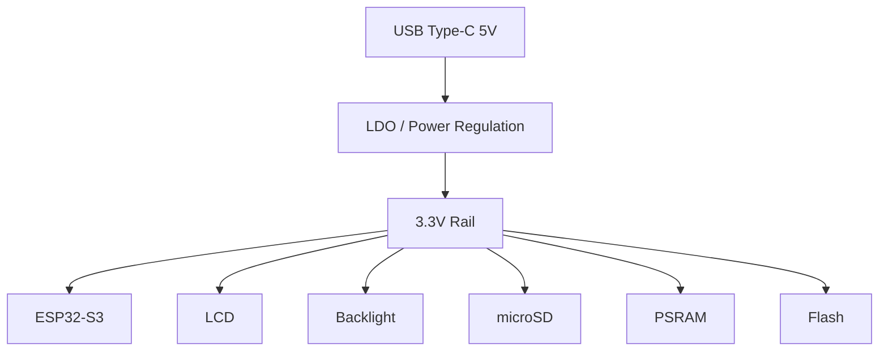

# Power Subsystem

Hardware reference for the power subsystem used by the **KeyKeeper2** project.

The project uses the onboard power circuitry of the **Waveshare ESP32-S3-LCD-1.47B** development board.

---

# Purpose

This document describes the electrical power architecture of the KeyKeeper2 hardware platform.

It includes:

* power sources;
* power distribution;
* voltage rails;
* power consumption;
* sleep modes;
* hardware limitations;
* design recommendations.

Software power management is documented separately in the developer documentation.

---

# Power Overview

The development board is powered through a **USB Type-C** connector.

The onboard power circuitry generates all voltages required by the integrated hardware components.

The firmware does not require any external power management hardware.

---

# Power Architecture

---

# Power Source

The primary power source is the USB Type-C connector.

| Parameter     | Value              |
| ------------- | ------------------ |
| Connector     | USB Type-C         |
| Input Voltage | 5 V DC             |
| Power Source  | USB Host / Charger |
| USB Standard  | USB 2.0            |

The board is intended to operate from a regulated 5 V USB supply.

---

# Power Rails

The onboard regulator generates the operating voltage used by all digital components.

| Rail  | Typical Usage                              |
| ----- | ------------------------------------------ |
| 5 V   | USB input                                  |
| 3.3 V | ESP32-S3, LCD, PSRAM, Flash, microSD, GPIO |

No additional voltage rails are required by the KeyKeeper2 hardware.

---

# Powered Components

The 3.3 V rail supplies the following devices.

| Component        | Powered From |
| ---------------- | ------------ |
| ESP32-S3         | 3.3 V        |
| LCD Controller   | 3.3 V        |
| LCD Backlight    | 3.3 V        |
| Flash Memory     | 3.3 V        |
| PSRAM            | 3.3 V        |
| microSD          | 3.3 V        |
| RGB LED          | 3.3 V        |
| Expansion Header | 3.3 V        |

---

# LCD Backlight

The LCD backlight is one of the largest power consumers on the board.

The firmware supports:

* backlight enable;
* backlight disable;
* brightness adjustment;
* automatic dimming.

Reducing the backlight brightness significantly lowers overall power consumption.

---

# USB Power

The USB interface provides both communication and power.

During normal operation USB is used for:

* powering the device;
* firmware updates;
* debugging;
* USB communication.

No additional power supply circuitry is required.

---

# Sleep Modes

The ESP32-S3 supports several low-power operating modes.

| Mode        | Description                              |
| ----------- | ---------------------------------------- |
| Active      | Normal operation                         |
| Light Sleep | CPU paused, peripherals partially active |
| Deep Sleep  | Minimum power consumption                |

When entering a low-power state, the firmware performs the following actions:

* turns off the LCD backlight;
* places the display into sleep mode;
* suspends unnecessary services;
* preserves system configuration.

The wake-up procedure restores normal operation automatically.

---

# Typical Power Consumers

Approximate power distribution during normal operation.

| Component         | Relative Consumption |
| ----------------- | -------------------: |
| LCD Backlight     |                 High |
| ESP32-S3 CPU      |                 High |
| Wi-Fi Radio       |                 High |
| LCD Controller    |               Medium |
| PSRAM             |                  Low |
| Flash             |                  Low |
| Encoder / Buttons |           Negligible |

Actual current consumption depends on CPU load, display brightness and wireless activity.

---

# Design Recommendations

To minimize power consumption:

* reduce LCD brightness whenever possible;
* disable the display during long idle periods;
* avoid unnecessary Wi-Fi activity;
* use Deep Sleep when the device is inactive;
* keep external peripherals disconnected when not required.

These recommendations are implemented by the Power Service in the firmware.

---

# Hardware Limitations

Developers should consider the following limitations.

* The board is designed for a regulated 5 V USB supply.
* The 3.3 V rail has limited output current for external peripherals.
* High display brightness increases power consumption considerably.
* Simultaneous heavy CPU load, Wi-Fi activity and maximum LCD brightness produce the highest current draw.
* External modules connected to the expansion header should not exceed the available current of the onboard regulator.

---

# Related Documents

| Document                        | Description          |
| ------------------------------- | -------------------- |
| `01_board.md`                   | Board description    |
| `02_display.md`                 | Display subsystem    |
| `03_input.md`                   | User input subsystem |
| `05_storage.md`                 | Storage subsystem    |
| `07_boot.md`                    | Boot process         |
| `docs/developer/04_freertos.md` | Runtime behaviour    |
| `docs/developer/11_bsp.md`      | BSP implementation   |

---

# Summary

The KeyKeeper2 power subsystem relies entirely on the integrated power circuitry of the Waveshare ESP32-S3-LCD-1.47B development board.

Power is supplied through USB Type-C and distributed via the onboard 3.3 V regulator to all system components. The firmware minimizes energy consumption by controlling the LCD backlight, using the ESP32-S3 low-power modes and suspending non-essential peripherals during idle periods.
